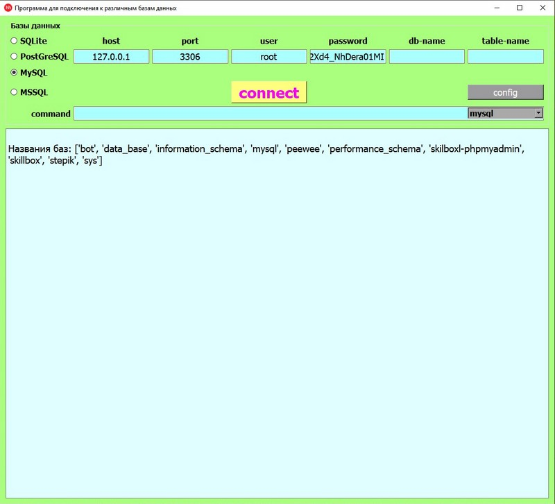

### Простенькая программа для подключения к различным базам данных и просмотра содержимого

+ Установка зависимостей:
>     pip install -r requirements.txt
+ Команда сборки pyinstaller для Windows:
>     pyinstaller main.py -F -w --i=favicon.ico

